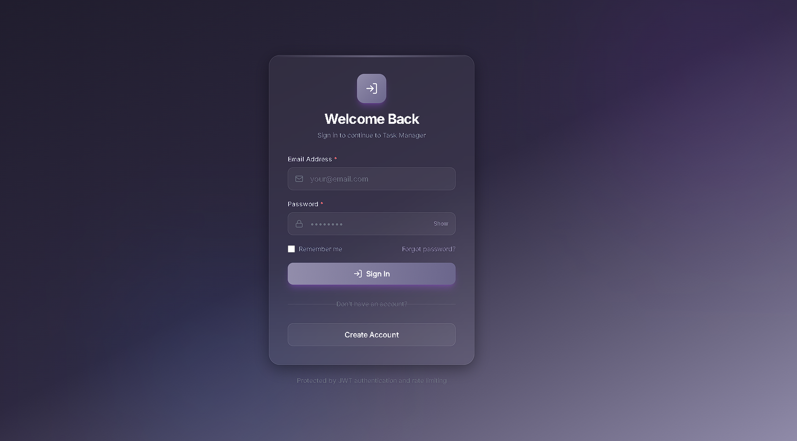
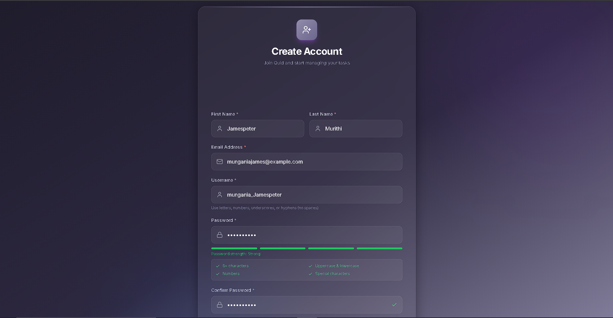
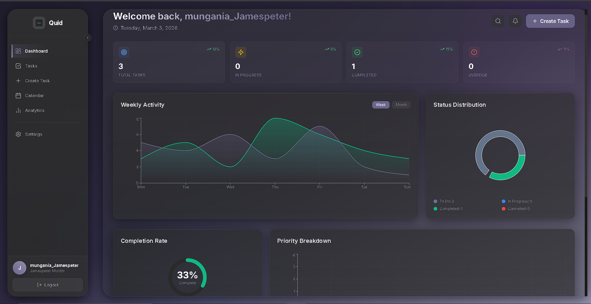
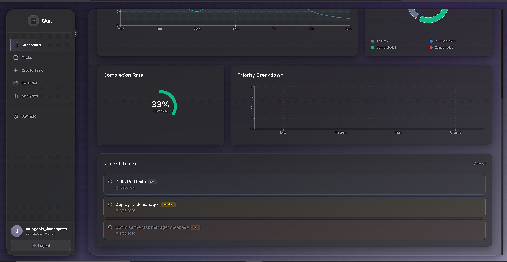
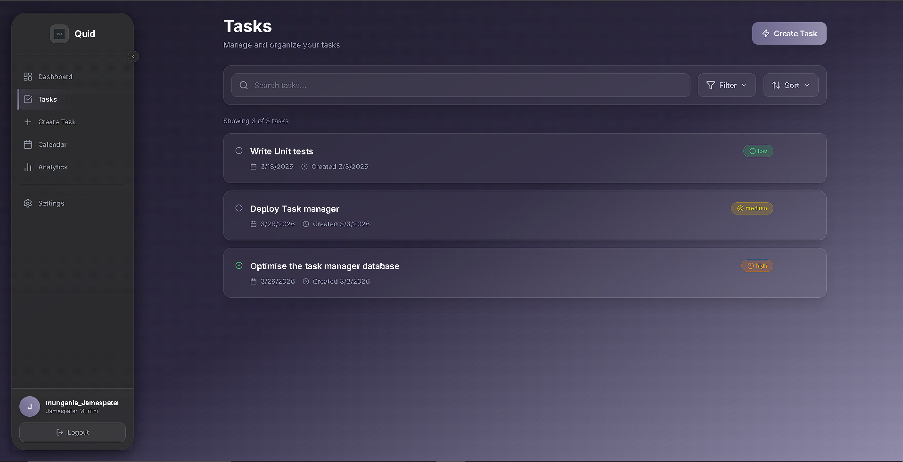
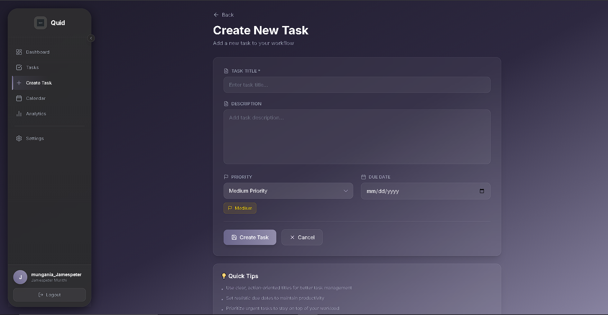
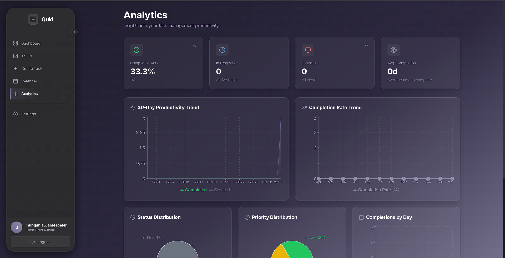
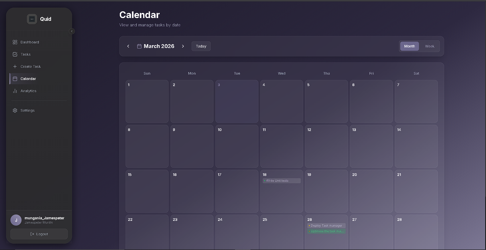
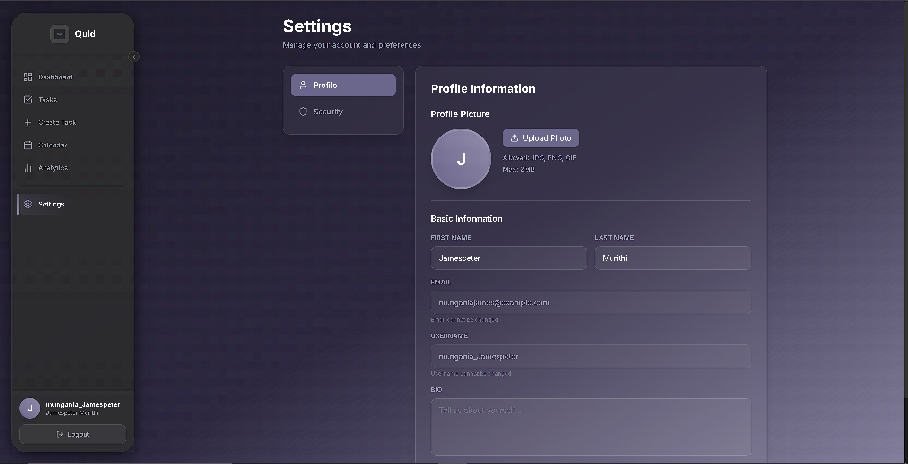
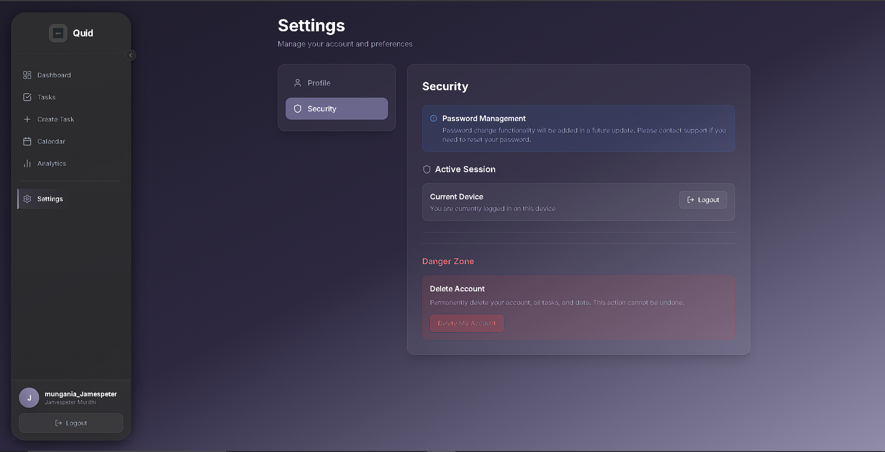

# Task Manager

A full-stack task management application built with Django REST Framework and React. This application provides a comprehensive solution for managing tasks with features like user authentication, task CRUD operations, analytics, calendar view, and customizable settings.

## 📸 Screenshots

### Authentication

#### Login Page

*Secure login with JWT authentication*

#### Registration Form

*User registration with validation*

### Dashboard

#### Main Dashboard

*Overview of tasks with statistics and quick actions*


*Task list with filtering and search capabilities*

### Task Management

#### Task View

*Detailed task view with all task information*

#### Create Task

*Create new tasks with title, description, priority, and due date*

### Analytics

#### Analytics Dashboard

*Visual analytics showing task completion rates, priority distribution, and trends*

### Calendar

#### Calendar View

*Calendar view to visualize tasks by due date*

### Settings

#### Settings Page

*User profile and account settings*


*Additional configuration options*

## ✨ Features

- **User Authentication**
  - JWT-based authentication with refresh tokens
  - User registration and login
  - Protected routes and API endpoints
  - Rate limiting and brute force protection

- **Task Management**
  - Create, read, update, and delete tasks
  - Task status tracking (Todo, In Progress, Completed, Cancelled)
  - Priority levels (Low, Medium, High, Urgent)
  - Due date management
  - Task search and filtering
  - Bulk operations
  - Task duplication

- **Dashboard**
  - Overview of all tasks
  - Quick statistics
  - Recent tasks
  - Overdue task notifications

- **Analytics**
  - Task completion rates
  - Priority distribution charts
  - Status breakdown
  - Performance trends

- **Calendar View**
  - Month view of tasks
  - Visual representation of due dates
  - Easy navigation between months

- **Settings**
  - User profile management
  - Account preferences
  - Security settings

## 🛠️ Tech Stack

### Backend

- **Framework**: Django 6.0
- **API**: Django REST Framework 3.16
- **Database**: MySQL 8.0
- **Authentication**: JWT (djangorestframework-simplejwt)
- **Caching**: Redis
- **API Documentation**: drf-spectacular (OpenAPI/Swagger)
- **Security**: 
  - django-defender (brute force protection)
  - django-ratelimit (rate limiting)
  - django-cors-headers
- **Server**: Gunicorn
- **Containerization**: Docker & Docker Compose
- **Testing**: pytest, pytest-django, factory_boy
- **Monitoring**: Sentry SDK

### Frontend

- **Framework**: React 19.2
- **Language**: TypeScript
- **Build Tool**: Vite
- **Routing**: React Router 7.11
- **Styling**: Tailwind CSS 3.4
- **HTTP Client**: Axios
- **Charts**: Recharts 3.6
- **Animations**: Framer Motion
- **Icons**: Lucide React

## 📋 Prerequisites

- Python 3.10+
- Node.js 18+
- Docker & Docker Compose (for containerized deployment)
- MySQL 8.0 (if running locally without Docker)
- Redis (if running locally without Docker)

## 🚀 Installation

### Using Docker (Recommended)

For detailed Docker documentation, including production deployment, see [backend/DOCKER.md](backend/DOCKER.md).

1. **Clone the repository**
   ```bash
   git clone <repository-url>
   cd Task-Manger
   ```

2. **Set up environment variables**
   
   Copy the example environment file and configure it:
   ```bash
   cd backend
   cp .env.example .env
   ```
   
   Edit `.env` with your settings:
   ```env
   # Django Settings
   SECRET_KEY=your-secret-key-here
   DEBUG=True
   ALLOWED_HOSTS=localhost,127.0.0.1
   ENVIRONMENT=development
   
   # Database
   DB_NAME=taskmanager_db
   DB_USER=taskmanager_user
   DB_PASSWORD=your-secure-password
   DB_HOST=db
   DB_PORT=3306
   
   # Redis
   REDIS_HOST=redis
   REDIS_PORT=6379
   
   # JWT Settings
   JWT_ACCESS_TOKEN_LIFETIME=60
   JWT_REFRESH_TOKEN_LIFETIME=1440
   ```

3. **Start services using Docker Compose**
   
   **Option A: Using Makefile (recommended)**
   ```bash
   cd backend
   make up-d        # Start in background
   make logs        # View logs
   make createsuperuser  # Create admin user
   ```
   
   **Option B: Using docker-compose directly**
   ```bash
   cd backend
   docker-compose up -d --build
   docker-compose exec backend python manage.py createsuperuser
   ```

   The backend will be available at `http://localhost:8000`
   
   **Available Makefile commands:**
   - `make dev` - Start development environment with hot reload
   - `make prod-d` - Start production environment with Nginx
   - `make test` - Run tests
   - `make migrate` - Run database migrations
   - `make shell` - Open Django shell
   - `make logs` - View logs
   - `make backup` - Backup database
   - Run `make help` to see all available commands

4. **Set up the frontend**
   ```bash
   cd ../frontend
   npm install
   npm run dev
   ```

   The frontend will be available at `http://localhost:5173`

### Local Development (Without Docker)

#### Backend Setup

1. **Create a virtual environment**
   ```bash
   cd backend
   python -m venv venv
   source venv/bin/activate  # On Windows: venv\Scripts\activate
   ```

2. **Install dependencies**
   ```bash
   pip install -r requirements.txt
   ```

3. **Set up environment variables** (create `.env` file as shown above)

4. **Set up MySQL database**
   ```bash
   mysql -u root -p
   CREATE DATABASE taskmanager_db;
   CREATE USER 'taskmanager_user'@'localhost' IDENTIFIED BY 'your-password';
   GRANT ALL PRIVILEGES ON taskmanager_db.* TO 'taskmanager_user'@'localhost';
   FLUSH PRIVILEGES;
   ```

5. **Run migrations**
   ```bash
   python manage.py migrate
   ```

6. **Create a superuser**
   ```bash
   python manage.py createsuperuser
   ```

7. **Run the development server**
   ```bash
   python manage.py runserver
   ```

#### Frontend Setup

1. **Install dependencies**
   ```bash
   cd frontend
   npm install
   ```

2. **Configure API endpoint**
   
   Update `src/services/apiClient.ts` if needed to point to your backend URL.

3. **Run the development server**
   ```bash
   npm run dev
   ```

## 🧪 Running Tests

### Backend Tests

```bash
cd backend
pytest
pytest --cov  # With coverage
```

### Run specific test files

```bash
pytest apps/tasks/tests.py
pytest apps/users/tests.py
```

## 📚 API Documentation

Once the backend is running, you can access the interactive API documentation:

- **Swagger UI**: http://localhost:8000/api/schema/swagger-ui/
- **ReDoc**: http://localhost:8000/api/schema/redoc/
- **OpenAPI Schema**: http://localhost:8000/api/schema/

### Main API Endpoints

#### Authentication
- `POST /api/users/register/` - Register new user
- `POST /api/users/login/` - Login user
- `POST /api/users/token/refresh/` - Refresh access token
- `POST /api/users/logout/` - Logout user

#### Tasks
- `GET /api/tasks/` - List tasks (with filtering and search)
- `POST /api/tasks/` - Create task
- `GET /api/tasks/{id}/` - Get task details
- `PUT /api/tasks/{id}/` - Update task
- `PATCH /api/tasks/{id}/` - Partial update task
- `DELETE /api/tasks/{id}/` - Delete task
- `GET /api/tasks/stats/` - Get task statistics
- `POST /api/tasks/bulk-status-update/` - Bulk update task status
- `POST /api/tasks/{id}/duplicate/` - Duplicate task

#### Users
- `GET /api/users/profile/` - Get user profile
- `PUT /api/users/profile/` - Update user profile

## 📁 Project Structure

```
Task-Manger/
├── backend/                    # Django backend
│   ├── apps/
│   │   ├── core/              # Core functionality and exceptions
│   │   ├── tasks/             # Task management app
│   │   │   ├── models.py      # Task model with optimizations
│   │   │   ├── views.py       # API views
│   │   │   ├── serializers.py # DRF serializers
│   │   │   ├── services.py    # Business logic
│   │   │   └── tests.py       # Unit tests
│   │   └── users/             # User management app
│   ├── task_manager/          # Main Django project
│   │   ├── settings.py        # Django settings
│   │   └── urls.py            # URL configuration
│   ├── docker-compose.yml     # Docker services configuration
│   ├── Dockerfile             # Backend Docker image
│   ├── requirements.txt       # Python dependencies
│   ├── pytest.ini             # Pytest configuration
│   └── gunicorn.conf.py       # Gunicorn settings
│
├── frontend/                  # React frontend
│   ├── src/
│   │   ├── components/        # React components
│   │   │   ├── auth/         # Authentication components
│   │   │   └── Sidebar.tsx   # Navigation sidebar
│   │   ├── contexts/         # React contexts
│   │   │   └── AuthContext.tsx
│   │   ├── pages/            # Page components
│   │   │   ├── dashboard/
│   │   │   ├── tasks/
│   │   │   ├── analytics/
│   │   │   ├── calendar/
│   │   │   └── settings/
│   │   ├── services/         # API services
│   │   │   ├── apiClient.ts
│   │   │   ├── authService.ts
│   │   │   └── tasksService.ts
│   │   └── types/            # TypeScript types
│   ├── package.json          # Node dependencies
│   └── vite.config.ts        # Vite configuration
│
└── images/                   # Screenshots and assets
```

## 🔐 Security Features

- JWT-based authentication with access and refresh tokens
- Token blacklisting for logout functionality
- Rate limiting on API endpoints
- Brute force protection with django-defender
- CORS configuration
- Input validation and sanitization
- SQL injection protection (Django ORM)
- XSS protection
- CSRF protection

## 🚀 Deployment

For detailed Docker deployment instructions, including production setup with Nginx, SSL, and monitoring, see [backend/DOCKER.md](backend/DOCKER.md).

### Backend Deployment

#### Using Docker (Recommended)

1. **Prepare production environment**
   ```bash
   cd backend
   cp .env.example .env.prod
   ```
   
   Edit `.env.prod` with production settings:
   ```env
   DEBUG=False
   ALLOWED_HOSTS=your-domain.com
   ENVIRONMENT=production
   SECRET_KEY=use-a-strong-random-key
   # ... other production settings
   ```

2. **Deploy using production compose**
   ```bash
   make prod-d  # Starts with Nginx, optimized settings
   ```
   
   Or manually:
   ```bash
   docker-compose -f docker-compose.prod.yml up -d --build
   ```

3. **Run migrations and create superuser**
   ```bash
   make migrate
   make createsuperuser
   ```

#### Manual Deployment

1. **Update environment variables for production**
   ```env
   DEBUG=False
   ALLOWED_HOSTS=your-domain.com
   ENVIRONMENT=production
   ```

2. **Collect static files**
   ```bash
   python manage.py collectstatic --noinput
   ```

3. **Run with Gunicorn**
   ```bash
   gunicorn --config gunicorn.conf.py task_manager.wsgi:application
   ```

### Frontend Deployment

1. **Update API endpoint** in `src/services/apiClient.ts` to point to production backend

2. **Build the production bundle**
   ```bash
   cd frontend
   npm run build
   ```

3. **Deploy the `dist` folder** to your hosting service:
   - **Vercel**: Connect GitHub repo and auto-deploy
   - **Netlify**: Drag and drop `dist` folder or use CLI
   - **AWS S3**: Upload `dist` contents to S3 bucket with static hosting
   - **Nginx**: Copy `dist` contents to web server directory

### Docker Production Features

The production Docker setup includes:
- **Multi-stage builds** for optimized image size
- **Nginx reverse proxy** with rate limiting and caching
- **SSL/TLS support** (configure in nginx/conf.d/default.conf)
- **Health checks** for all services
- **Automatic database migrations** on startup
- **Redis caching** for improved performance
- **Gunicorn** with optimized worker configuration
- **Volume persistence** for data and logs

## 🤝 Contributing

Contributions are welcome! Please follow these steps:

1. Fork the repository
2. Create a feature branch (`git checkout -b feature/YourFeature`)
3. Commit your changes (`git commit -m 'Add some feature'`)
4. Push to the branch (`git push origin feature/YourFeature`)
5. Open a Pull Request

## 📝 License

This project is licensed under the MIT License - see the LICENSE file for details.

## 👤 Author

Jamespeter murithi

## 🙏 Acknowledgments

- Django REST Framework for the excellent API framework
- React and the React community
- All open-source libraries used in this project

---

**Note**: Make sure to change default passwords and secret keys before deploying to production!